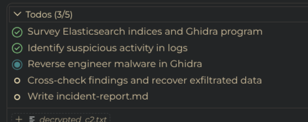

# Test 2 KI generert skill
Dette er en test for å se om en KI generert skill vil jobbe bedre en uten en KI generert skill. For å gjære det enklere vil det bli laget kun en skill fil, i henhold til prosedyren vist under:


## Prompt for gjennomføring 
```
Perform incident analysis to identify IOCs and artifacts. Provide proof for each indicator from available data/tools. Include interesting details that reveal what the attacker did, and explain what likely happened.
```
Det vil brukes ```/incident-analysis``` for å tvinge fram bruk av skills.


### Steg å gjøre før kjøring:

1. Starte alle nødvendige mcp servere (Ghidra, Elastic, Pylance)
2. Om nødvendig resette Ghidra
3. Åpne copilot debugger
```
>github.copilot.chat.agentdebug
```
4. Dobbelsjekke at riktig agent kjører


## Observasjoner

Denne tulla litt med å kjøre python i starten men så fikk det den till. Var veldig god. Men brukte lang tid. Litt rart var at den var mer fokusert på å fine ting enn å følge malen. Se bilde at den bare avslutta på ghidra delen:



I tilegg måtte jeg trykke continue og retry for å få den igang